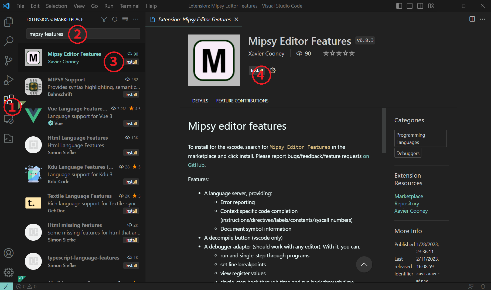
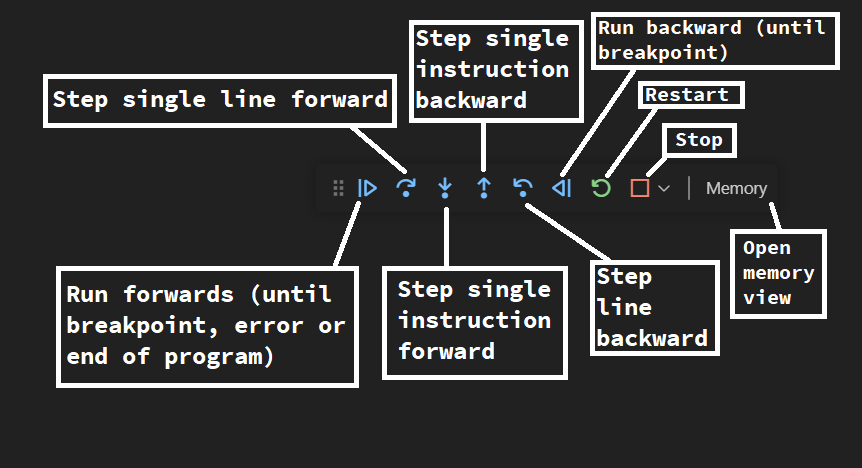

# Mipsy editor features

To install for the vscode, search for `Mipsy Editor Features` in the marketplace and click install. Please report bugs/feedback/feature requests [on GitHub](https://github.com/XavierCooney/mipsy-editor-features/issues).

Screenshot:


## How to use (vscode)

### Install

To install the extension:
1. Open the extensions marketplace (either select in the activity bar, use the `Extensions: Install Extensions` command, or press ctrl+shift+x).
2. Search for `mipsy editor features`
3. Select the extension
4. Press install.



### Editing features

Out of the box, installing `mipsy editor features` will enable a number of features.

**Code completion**: vscode will suggest instructions, label names, constant names, directives, registers and syscall numbers. Depending on your vscode configuration this will be either automatic or triggered by some keybinding (typically ctrl+space). To accept code completion suggets, you can (typically) press tab.

**Diagonstics**: vscode will report code which causes either a parsing or compilation in mipsy. Problematic code will be underlined, and error messages can be shown on hover, and in the problems view.

**Go to definition**: Control click on a label or constant usage to jump to the definition of the label/constant.

**Document symbols**: You can use features like `Go to symbol in Editor` (ctrl+shift+o) and document breadcumbs (ctrl+shift+.) to quickly navigate longer MIPS programs.

## Debugging features

The extension features a debugger which allows you to run and debug your MIPS programs. To activate it, select the file you want to run, and press the `Debug MIPS` button (to the left of the `Decompile MIPS` button). This will start a new debug session.

If it's not already automatically opened, select the `Run and Debug` view container (from the activity bar, typically to the left of the editor, ctrl+shift+d) and the debug console view (next to the terminal, ctrl+shift+y).

Currently the `Watch` and `Call Stack` views in the debug view container aren't used, so you should minimise them. You should open the `MIPS I/O` view, which will show the input/output. I like to drag it from the debug container into the debug console view, so I can view them simaltaneously side-by-side.

The debug toolbar (typically near the top of the window) allows you to control the debugger.



The debug console displays messages related to the running program, including syscalls. To view just the output of the program, use the MIPS I/O view. When your program executes an input syscall, you'll be prompted to provide the input in the debug console.

To set a breakpoint, select the breakpoint button immediately to the left of the line number of the relevant line. Valid breakpoints will appear as filled red circles, and invalid breakpoints will appear as unfilled circles. You can also manage breakpoints (including disabling/enabling all) in the breakpoints view, although currently inserting new breakpoints cannot be done in the breakpoints view (this will hopefully be supported soon).

You can view the contents of registers in the `Variables` views. Registers which aren't displayed are uninitialised (in the future I might also by default not show lesser-used registers such as `$k0` and `$k1`).

You can view a hexdump of the data and stack segments by pressing the `Memory` button on the debug toolbar. The first column shows the address, the second shows the bytes (in hexadecimal) at that address, and the third shows the ASCII representation of the corresponding bytes (if there is one, otherwise a red dot). Grey question marks indicate uninitialised bytes. You can drag the memory view into another location like any other editor. You may want to adjust the bytes per row depending on the width of the view.

If you have a program which requires a large amount of user input, you can right click an editor (while you're debugging a MIPS program) and select `Send file to MIPS input`. This will queue up the contents of the file as input to the currently running MIPS program (using scanf-like semantics). Alternatively you can select some text and then right click the selection and use `Send selection to MIPS input`. Currently only read integer and read character (with `" %c"` semantics) are supported with this feature, in the future I might add support for read string.

The open/read/write/close file syscalls and read/print float syscalls have no support.

Currently multiple file programs are only supported in the LSP (if I get time I'll also add support in the debugger). If you have a file `a.s` and want to have it linked with `b.s` and `c.s`, include the following line in `a.s`:
```
# @[multifile(a.s, b.s, c.s)]
```
The inclusion of `a.s` in the above line is optional, but makes it easy to copy this line into `b.s` and `c.s`. If you're using virtual workspaces, you'll be prompted by the language server to actually open `b.s` and `c.s` in your editor [due to a limitation in the language server protocol](https://github.com/microsoft/language-server-protocol/issues/1264).

## Alternate editors

If you're using a build of code without the proprietary marketplace, you can either grab a release from the Github releases (it might be out of date, let me know if that's the case), download the VSIX for the [extension page](https://marketplace.visualstudio.com/items?itemName=xavc.xavc-mipsy-features), or build the extension yourself.

I've got the language server working somewhat smoothly in neovim. If you're interested in more details let me know and I'll write up some more specific instructions. The language server should work for [any editor which supports the language server protocol](https://microsoft.github.io/language-server-protocol/implementors/tools/). The debugger uses the debug adapter protocol, which means that the basic features of the debugger should theoretically work with other editors, but I haven't tested that yet.

# Technical details

Language server diagonstics / decompile button / debugger all work by running mipsy compiled to WASM using `wasm-pack`. See `mipsy_vscode/src/lib.rs`. If I remember I'll add some more technical details.


TODO:
 - Better breakpoint support, as well as other watchpoints
 - Improve code quality
 - Use a bundler to reduce extension size


To build, roughly:
```
git clone https://github.com/insou22/mipsy.git
npm i
./generate_syntax.py
(cd mipsy_vscode; wasm-pack build --target nodejs --release)
npm run compile
```
